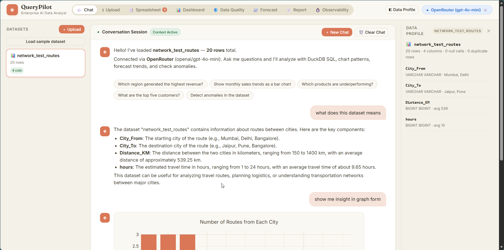
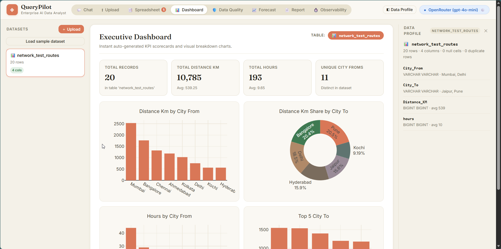
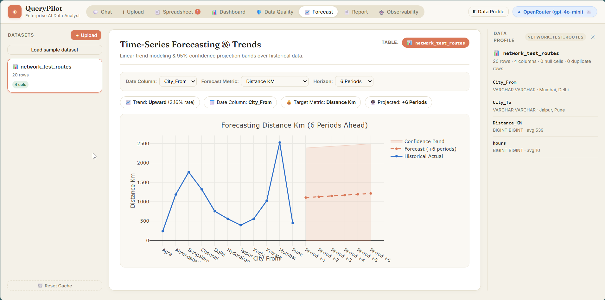
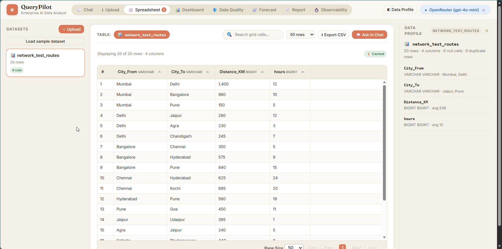
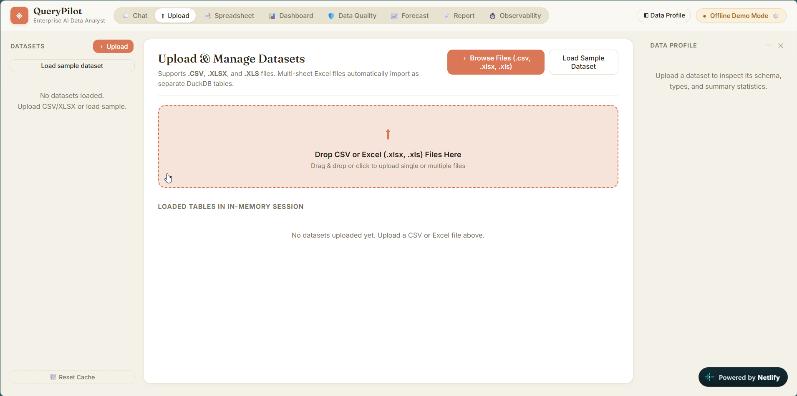
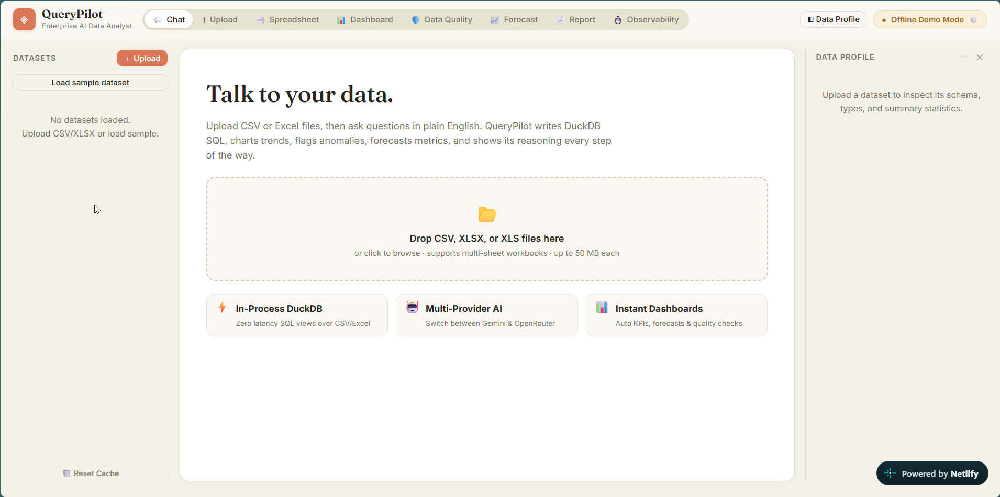

# ◈ QueryPilot — Enterprise AI Data Analyst

**An AI-powered Data Analyst you can talk to.** Upload one or more CSV or Excel files and interact with your data in natural language. QueryPilot answers questions, generates business insights, builds interactive visualizations, detects statistical anomalies, forecasts future trends, audits data quality, and explains its reasoning step-by-step using an LLM.

> Built for the **Digital Back Office Ltd.** *AI Engineer Assignment*.

---

## 🎥 Demo Video

[](demo_video.mp4)

> 📹 **Walkthrough Highlights in `demo_video.mp4`:**
> 1. **Multi-File Dataset Upload**: Drag-and-drop CSV & Excel workbooks with automatic merged-header detection.
> 2. **Natural Language Q&A**: Live DuckDB SQL generation, execution latencies, and interactive Plotly visualizations.
> 3. **Statistical Anomaly Detection**: Explaining IQR bounds, standard deviations, and business rationales.
> 4. **Auto-Dashboards & Data Quality**: Executive KPI scorecards, 0–100 health audits, and time-series forecasting.

---

## 📸 Application Screenshots

### 1. Conversational AI Analyst & SQL Generation
Ask business questions in natural language. QueryPilot writes strict DuckDB SQL, streams real-time reasoning, and explains statistical anomalies with outlier boundaries and sample flagged records.


---

### 2. Interactive Charts & Visualizations
Automatic generation of interactive Plotly charts (Bar, Line, Area, Scatter, Pie, Donut) directly within the chat conversation stream.


---

### 3. Auto-Generated Executive Dashboard
Instant auto-generated KPI scorecards and visual breakdown charts with smart measure classification (differentiating quantitative measures from postal/ID codes).



---

### 4. Time-Series Forecasting & Trend Projections
Historical linear regression with 95% confidence projection bands, zero-floor bounds for non-negative metrics, and dynamic date/metric dropdown switchers.



---

### 5. Data Quality & Health Scorecard
Comprehensive data quality audit calculating a 0–100 health score, completeness %, uniqueness %, missing cell counts, and >3σ outlier matrices with actionable recommendations.


---

### 6. Interactive Spreadsheet Grid (Tabulator)
Excel-like virtualized data grid with instant search across all columns, customizable row pagination (25–500 rows), and one-click CSV export.



---

### 7. Multi-File Dataset Upload & Management
Drag-and-drop or browse `.csv`, `.xlsx`, and `.xls` files with multi-sheet workbook support and instant schema extraction.



---

### 8. Welcome Screen & In-Memory DuckDB Engine
Overview dashboard highlighting zero-latency in-process DuckDB views, multi-provider AI model switching, and sample dataset exploration.



---

## 📋 Requirements & Feature Coverage

### 1. Core Features

| Requirement | How QueryPilot Delivers It | Status |
|---|---|:---:|
| **Upload & Validate CSV/Excel Files** | Supports multi-file `.csv`, `.xlsx`, and `.xls` uploads. Automatically promotes merged header rows, handles multi-sheet workbooks as distinct DuckDB views, and validates file formats and sizes. | ✅ **Covered** |
| **Natural Language Q&A** | Powered by **Google Gemini (3.6/3.7 Flash)**, **OpenRouter (GPT-4o, Claude 3.5 Sonnet, DeepSeek)**, and an **Offline Demo Mode**. Answers are computed in real time from SQL results. | ✅ **Covered** |
| **Business Insights & Summaries** | Aggregation-first prompt (`SUM`, `AVG`, `GROUP BY`) provides clear, concise executive summaries without hallucinated figures. | ✅ **Covered** |
| **Interactive Visualizations** | Generates Plotly JSON specs for **Bar, Line, Area, Scatter, Pie, and Donut** charts, rendered client-side via Plotly.js. | ✅ **Covered** |
| **SQL & Code Generation** | Emits strict, read-only **DuckDB SQL** in collapsible, syntax-highlighted code blocks with execution row counts and one-click copy. | ✅ **Covered** |
| **Anomaly Detection & Explanation** | Statistical **IQR and Z-Score (>3σ)** scans per numeric column with bounds, standard deviations, sample flagged rows, and business rationales. | ✅ **Covered** |
| **Explainable Reasoning** | Exposes the agent's thought process, tool execution status (`Running run_sql…`), and calculation methodology before every answer. | ✅ **Covered** |
| **Conversation Context Throughout Session** | Maintains multi-turn conversation memory (`contents` / `messages`). Includes an active context badge and a **“＋ New Chat”** option to start fresh threads without losing loaded tables. | ✅ **Covered** |

---

### 2. Example Questions Supported

* 📈 **“Which region generated the highest revenue?”** — Aggregates `SUM(revenue) GROUP BY region` and ranks regions.
* 📊 **“Show monthly sales trends.”** — Plots historical revenue over time as an interactive line/bar chart.
* 📦 **“Which products are underperforming?”** — Filters and ranks products with lowest revenue/volume.
* 👥 **“What are the top five customers?”** — Emits `ORDER BY revenue DESC LIMIT 5` with exact totals.
* 💻 **“Generate SQL for this analysis.”** — Outputs executable, syntax-highlighted DuckDB SQL queries.
* 🚨 **“Detect anomalies in the dataset.”** — Surfaces planted outliers in revenue, negative quantities, and volume spikes.

---

### 3. Bonus (Optional) Features (All 13 Implemented)

- [x] **Multi-File Analysis**: In-memory DuckDB views over multiple CSV/Excel files simultaneously with cross-table analytics.
- [x] **Executive Dashboard Generation**: Dedicated **Dashboard Tab** with intelligent measure detection, KPI scorecards, and 4 automated visual breakdown charts.
- [x] **Data Quality Checks**: Dedicated **Data Quality Tab** computing 0–100 health scores, completeness %, uniqueness %, missing cell counts, and outlier matrices.
- [x] **Time-Series Forecasting**: Dedicated **Forecast Tab** with linear trend modeling, 95% confidence bands, 0-floor bounds, and interactive metric/date dropdown selectors.
- [x] **Agentic Workflows**: Autonomous self-correcting loop where SQL syntax errors are returned to the model to automatically rewrite and fix queries (up to 8 tool-call attempts).
- [x] **Tool Calling**: Native Google Gemini Function Calling and OpenRouter/OpenAI Tool Calling schemas (`run_sql`, `build_chart`, `detect_anomalies`, `profile_schema`).
- [x] **Semantic & Grid Search**: Cell-level instant search in the Tabulator virtual grid + schema digest lookup.
- [x] **Caching**: In-memory DuckDB table registrations + LocalStorage preview and session caching (`LS_SESSION_KEY`, `LS_PREVIEW_PREFIX`).
- [x] **Authentication & Key Overrides**: Settings modal to configure API keys and switch between Gemini, OpenRouter, and Offline Demo mode on the fly.
- [x] **Export Reports**: Dedicated **Report Tab** generating structured Markdown reports with browser Print/PDF export, plus full CSV query downloads (`/api/exports/`).
- [x] **Streaming Responses**: Server-Sent Events (SSE) streaming live tokens and discrete chart/anomaly/status events.
- [x] **Observability & Logging**: Dedicated **Observability Tab** logging every executed SQL query, execution latency (ms), row counts, and provider status.
- [x] **Evaluation Framework**: Dynamic model benchmarking and provider switching between Gemini 3.6/3.7 Flash, GPT-4o, Claude 3.5 Sonnet, and DeepSeek.

---

## 🚀 Quickstart & Setup

### Option 1: Run Locally (.venv)

```bash
# 1. Clone repository
git clone https://github.com/anuragsgupta/QueryPilot.git
cd QueryPilot

# 2. Configure environment (Optional: add GEMINI_API_KEY or OPENROUTER_API_KEY)
cp .env.example .env

# 3. Create virtual environment & install dependencies
python -m venv .venv
# Windows:
.venv\Scripts\activate
# Linux/macOS:
source .venv/bin/activate

pip install -r requirements.txt

# 4. Start QueryPilot
uvicorn app.main:app --reload
```
Open **[http://localhost:8000](http://localhost:8000)** in your browser!

---

### Option 2: Run with Docker

```bash
docker compose up --build
```
Open **[http://localhost:8000](http://localhost:8000)**. The self-contained container serves both the FastAPI backend and frontend SPA.

---

### Option 3: Run Tests

```bash
pip install -r requirements-dev.txt
pytest -v
```
*Includes 22 passing tests verifying SQL security guard, DuckDB engine, anomaly math, and REST endpoints.*

---

## 🏗️ Architecture


---

## 📑 Feature Views Breakdown

1. **💬 Chat**: Natural-language conversational data analyst with SSE token streaming, expandable DuckDB SQL queries, interactive Plotly charts, anomaly inspection cards, and **“＋ New Chat”** context reset.
2. **⬆ Upload**: Drag-and-drop or browse `.csv`, `.xlsx`, and `.xls` files with multi-sheet workbook support and instant schema extraction.
3. **📑 Spreadsheet**: Virtualized data grid (Tabulator) with cell-level search across all columns, customizable row pagination (25–500 rows), and one-click CSV export.
4. **📊 Dashboard**: Executive KPI scorecards and visual breakdown charts with smart metric classification (distinguishing quantitative measures from postal/ID codes).
5. **🛡️ Data Quality**: Automated health audits (0–100 score), completeness %, uniqueness %, missing cell counts, duplicate row analysis, and >3σ outlier matrices.
6. **📈 Forecast**: Historical time-series regression with 95% confidence intervals, non-negative projection floors, and interactive metric/date dropdown selectors.
7. **📄 Report**: Instant structured executive summary report in Markdown with direct browser print / PDF export styling.
8. **⏱️ Observability**: Live execution audit logging all executed SQL queries, latencies (ms), and active AI provider diagnostics.

---

## 🔒 Security & Design Decisions

* **Text-to-SQL over RAG**: Tabular data requires exact mathematical calculations; vector embeddings hallucinate aggregations. DuckDB executes all arithmetic in-process.
* **Strict Read-Only SQL Sandbox**: Every generated query passes AST validation: single statement only, restricted to `SELECT/WITH/DESCRIBE/SHOW/EXPLAIN`, with a destructive keyword denylist (`DROP`, `DELETE`, `INSERT`, `ATTACH`, `COPY`, etc.).
* **Context-Window Protection**: Query results sent to the LLM are capped at `MAX_ROWS_TO_LLM` (20 rows). Larger results are written to a downloadable CSV export, preventing token overflow and latency spikes.
* **Self-Correcting Execution**: If a query syntax error occurs, the DuckDB error message is fed back into the model to automatically fix the query (bounded by tool-call steps).
* **Offline Demo Mode**: If no API key is provided, QueryPilot runs via a deterministic rule-based analyst across all tools.

---

## 📡 API Endpoints Reference

| Route | Method | Description |
|---|---|---|
| `/api/config` | `GET` | Active AI provider, model names, and API key configuration status |
| `/api/config/switch` | `POST` | Switch active provider (Gemini / OpenRouter / Demo) and model dynamically |
| `/api/upload` | `POST` | Multipart upload for CSV, XLSX, and XLS datasets with header cleanup |
| `/api/sample` | `POST` | Load bundled sample sales dataset into an active session |
| `/api/chat` | `POST` | `{session_id, message, provider, model}` → SSE stream |
| `/api/chat/new` | `POST` | `{session_id}` → Reset conversation memory while keeping tables in DuckDB |
| `/api/preview/{sid}/{table}` | `GET` | Paginated data grid preview for the Spreadsheet viewer |
| `/api/dashboard/{sid}/{table}` | `GET` | Compute KPIs and multi-chart layout for executive dashboard |
| `/api/quality/{sid}/{table}` | `GET` | Audit dataset completeness, uniqueness, and column health |
| `/api/forecast/{sid}/{table}` | `GET` | Time-series trend projection and confidence intervals |
| `/api/report/{sid}/{table}` | `GET` | Generate printable Executive Summary Report in Markdown |
| `/api/logs/{sid}` | `GET` | Retrieve query audit logs and execution latency metrics |
| `/api/exports/{sid}/{file}` | `GET` | Download full SQL query results exceeding 20 rows |

---

## 📁 Sample Dataset

* **`data/sales.csv`**: 482 rows of Indian retail sales (orders, regions, cities, categories, products, customers, quantities, revenue) across 14 months.
* **Planted Anomalies for Testing**: Seven revenue spikes, one negative quantity, one missing city, and one duplicate row to test statistical detection and data quality audits.
* Regenerate anytime using `python data/make_sample_dataset.py`.

---

## 📂 Project Structure

```
querypilot/
├── app/
│   ├── __init__.py
│   ├── config.py             # Environment configuration, safety limits, and provider defaults
│   ├── engine.py             # DuckDB engine, read-only SQL guard, and smart header sanitization
│   ├── agent.py              # Google Gemini function-calling agent with self-correction
│   ├── openrouter_agent.py   # OpenRouter API client (GPT-4o, Claude 3.5, DeepSeek)
│   ├── demo_agent.py         # Offline deterministic agent (zero API keys needed)
│   ├── tools.py              # ToolBox: run_sql, build_chart, detect_anomalies, profile_schema
│   ├── analytics.py          # Dashboard generation, quality scorecard, forecasting, and reporting
│   ├── anomalies.py          # IQR & Z-score statistical anomaly detection
│   ├── charts.py             # Plotly JSON chart specification builder
│   └── main.py               # FastAPI application with REST endpoints, CORS, and SSE streaming
├── frontend/
│   ├── index.html            # Single-page application layout with 8 dedicated view tabs
│   ├── css/
│   │   └── app.css           # Modern editorial design system with dark accents & responsive grid
│   ├── js/
│   │   └── app.js            # Frontend logic, state management, SSE handling, and Tabulator grids
│   └── vendor/
│       ├── plotly.min.js     # Vendored Plotly.js charting library
│       ├── tabulator.min.js  # Vendored Tabulator interactive spreadsheet grid
│       └── tabulator.min.css # Tabulator styling
├── screenshot/               # High-resolution screenshots of all application views
│   ├── chat.png
│   ├── chat graph.png
│   ├── dashboard.png
│   ├── data quality.png
│   ├── forecasting.png
│   ├── home.png
│   ├── spreadsheet.png
│   └── upload.png
├── data/
│   ├── sales.csv             # Bundled Indian retail sales dataset with planted anomalies
│   └── make_sample_dataset.py# Script to generate sample datasets
├── tests/                    # Test suite for SQL guard, DuckDB engine, and analytics (22 passed)
├── requirements.txt          # Production Python dependencies
├── requirements-dev.txt      # Development & testing dependencies
├── Dockerfile                # Production Docker container
├── docker-compose.yml        # Docker Compose configuration
├── render.yaml               # Render 1-click cloud deployment blueprint
├── netlify.toml              # Netlify frontend deployment configuration
└── README.md
```
