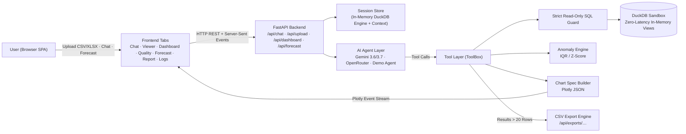

# ◈ QueryPilot — Enterprise AI Data Analyst

**An AI data analyst you can talk to.** Upload CSV or Excel files, ask questions in plain English, and get instant answers — backed by DuckDB SQL, interactive Plotly charts, statistical anomaly detection, smart executive dashboards, data quality audits, time-series forecasting, and an auditable chain of reasoning.

---

## What It Does

| Capability | How It Works |
|---|---|
| **Multi-File Dataset Upload** | Supports `.csv`, `.xlsx`, and `.xls` files. Multi-sheet Excel workbooks import as separate DuckDB tables with auto-header promotion for merged title banners. |
| **Natural-Language Q&A** | Gemini & OpenRouter agents write **read-only DuckDB SQL** and answer strictly from real results — never hallucinating numbers from model weights. |
| **Multi-Turn Conversation Context** | Session-scoped context (`contents`) persists throughout the conversation with support for follow-up questions and an instant **“＋ New Chat”** option. |
| **Interactive Spreadsheet Grid** | Dedicated **Spreadsheet Tab** powered by Tabulator with client-side virtual scrolling, cell search, custom pagination, and one-click CSV export. |
| **Executive Auto-Dashboards** | Instant KPI scorecards and visual breakdown charts with **intelligent measure classification** (preventing nonsensical aggregation of IDs, pincodes, and phone numbers). |
| **Data Quality & Health Scorecard** | Automated health scoring (0–100), missing value audit, duplicate row detection, >3σ outlier detection, and actionable data hygiene recommendations. |
| **Time-Series Forecasting & Trends** | Linear trend modeling and 95% confidence projection intervals with **user-selectable metrics and date columns**, bounded at zero for non-negative measures. |
| **Executive Reports** | Auto-generates structured, printable executive summary reports in Markdown with direct browser print / PDF export support. |
| **Query Observability & Audit Logs** | Dedicated **Observability Tab** logging every generated SQL query, execution latency (ms), row counts, and provider status in real time. |
| **Multi-Provider AI Switching** | Switch on-the-fly between **Google Gemini (3.6/3.7 Flash)**, **OpenRouter (GPT-4o, Claude 3.5 Sonnet, DeepSeek)**, and an **Offline Demo Mode**. |
| **Statistical Anomaly Detection** | IQR & Z-score scans per numeric column with bounds, σ, sample flagged rows, and business explanations. |
| **Strict Read-Only SQL Guard** | Single statement enforcement, AST validation, comment stripping, and a forbidden keyword denylist (`DROP`, `DELETE`, `INSERT`, `ATTACH`, `COPY`, etc.). |

---

## Quickstart

```bash
# 1. Clone the repository and navigate into the folder
cd querypilot

# 2. (Optional) Configure your AI provider keys in .env
cp .env.example .env
# Edit .env with your GEMINI_API_KEY or OPENROUTER_API_KEY

# 3. Install dependencies and start the app
python -m venv .venv
# On Windows: .venv\Scripts\activate
# On Linux/macOS: source .venv/bin/activate

pip install -r requirements.txt
uvicorn app.main:app --reload
```

Open **http://localhost:8000** in your browser, click **“Load sample dataset”** or upload your own CSV/Excel file, and start exploring!

### Netlify Deployment

QueryPilot includes a pre-configured `netlify.toml` file ready for one-click deployment:
1. Push your repository to GitHub: `https://github.com/anuragsgupta/QueryPilot`
2. In [Netlify Dashboard](https://app.netlify.com), click **Add new site > Import an existing project**.
3. Select your `QueryPilot` repository.
4. Netlify automatically detects `netlify.toml` (`publish = "frontend"`).
5. Set your backend URL or proxy target in `netlify.toml` / Netlify site redirects.

---

## Architecture



---

## Dedicated Feature Views

1. **💬 Chat**: Conversational SQL analyst with live SSE token streaming, expandable DuckDB SQL queries, interactive Plotly charts, and anomaly inspection cards.
2. **⬆ Upload**: Drag & drop or browse `.csv`, `.xlsx`, and `.xls` files with multi-sheet workbook support and instant schema extraction.
3. **📑 Spreadsheet**: Excel-like interactive data grid with instant search across all columns, customizable row pagination (25–500 rows), and CSV downloads.
4. **📊 Dashboard**: Auto-generated executive KPI scorecard and visual breakdowns (bar charts, donut share, time trends, top entity rankings) with intelligent metric filtering.
5. **🛡️ Data Quality**: Comprehensive health audit checking completeness %, uniqueness %, missing cell counts, and >3σ outliers.
6. **📈 Forecast**: Historical time-series regression with 95% confidence intervals, non-negative projection floors, and interactive metric/date dropdowns.
7. **📄 Report**: One-click printable executive summary report in Markdown.
8. **⏱️ Observability**: Live execution logs of all executed SQL queries, latencies (ms), and active AI provider diagnostics.

---

## Project Structure

```
querypilot/
├── app/
│   ├── __init__.py
│   ├── config.py             # Environment configuration, safety limits, and provider defaults
│   ├── engine.py             # DuckDB engine, read-only SQL guard, and smart header sanitization
│   ├── agent.py              # Google Gemini function-calling agent with self-correction
│   ├── openrouter_agent.py   # OpenRouter API client (GPT-4o, Claude 3.5, DeepSeek)
│   ├── demo_agent.py         # Offline deterministic agent (zero API keys needed)
│   ├── tools.py              # ToolBox: run_sql, build_chart, detect_anomalies, profile_schema
│   ├── analytics.py          # Dashboard generation, quality scorecard, forecasting, and reporting
│   ├── anomalies.py          # IQR & Z-score statistical anomaly detection
│   ├── charts.py             # Plotly JSON chart specification builder
│   └── main.py               # FastAPI application with REST endpoints and SSE streaming
├── frontend/
│   ├── index.html            # Single-page application layout with 8 dedicated view tabs
│   ├── css/
│   │   └── app.css           # Modern editorial design system with dark accents & responsive grid
│   ├── js/
│   │   └── app.js            # Frontend logic, state management, SSE handling, and Tabulator grids
│   └── vendor/
│       ├── plotly.min.js     # Vendored Plotly.js charting library
│       ├── tabulator.min.js  # Vendored Tabulator interactive spreadsheet grid
│       └── tabulator.min.css # Tabulator styling
├── data/
│   ├── sales.csv             # Bundled Indian retail sales dataset with planted anomalies
│   └── make_sample_dataset.py# Script to generate sample datasets
├── tests/                    # Test suite for SQL guard, DuckDB engine, and analytics
├── requirements.txt          # Production Python dependencies
├── Dockerfile                # Production Docker container
├── docker-compose.yml        # Docker Compose configuration
└── README.md
```

---

## API Endpoints

| Route | Method | Description |
|---|---|---|
| `/api/config` | `GET` | Active AI provider, model names, and API key status |
| `/api/config/switch` | `POST` | Switch active provider (Gemini / OpenRouter / Demo) and model |
| `/api/upload` | `POST` | Multipart upload for CSV, XLSX, and XLS datasets |
| `/api/sample` | `POST` | Load bundled sample sales dataset into an active session |
| `/api/chat` | `POST` | `{session_id, message, provider, model}` → SSE stream |
| `/api/chat/new` | `POST` | `{session_id}` → Reset conversation memory while keeping tables |
| `/api/preview/{sid}/{table}` | `GET` | Paginated data grid preview for the Spreadsheet viewer |
| `/api/dashboard/{sid}/{table}` | `GET` | Compute KPIs and multi-chart layout for executive dashboard |
| `/api/quality/{sid}/{table}` | `GET` | Audit dataset completeness, uniqueness, and column health |
| `/api/forecast/{sid}/{table}` | `GET` | Time-series trend projection and confidence intervals |
| `/api/report/{sid}/{table}` | `GET` | Generate printable Executive Summary Report in Markdown |
| `/api/logs/{sid}` | `GET` | Retrieve query audit logs and execution latency metrics |
| `/api/exports/{sid}/{file}` | `GET` | Download full SQL query results exceeding 20 rows |

---

## Design & Security Highlights

* **Text-to-SQL over RAG**: Tabular data requires exact arithmetic; vector embeddings hallucinate totals. DuckDB performs all mathematical operations in-process.
* **SQL Guard Boundary**: Every query is strictly validated against a destructive keyword denylist (`DROP`, `DELETE`, `INSERT`, `ATTACH`, `COPY`, etc.) and restricted to single read-only `SELECT/WITH/DESCRIBE/SHOW/EXPLAIN` statements.
* **Context-Window Safety**: Large query results (>20 rows) are written to a downloadable CSV export and truncated for the model, preventing token overflow and latency spikes.
* **Self-Correcting Agent**: If a SQL query syntax error occurs, the DuckDB error message is fed back into the model to automatically rewrite and fix the query (bounded by tool-call steps).
